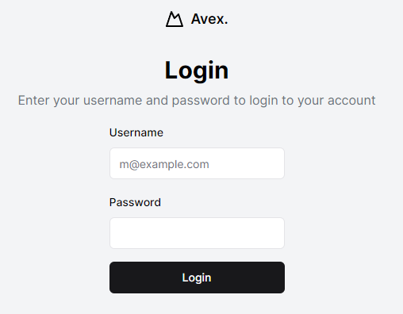

# ChatRoom
A simple chat room app written with Go + HTMX. The purpose of this project is to learn more about how a simple application may look when build using Go and HTMX, two technologies that I do not use in my day job.

## Project Requirements

### Login Page

Users should be able to:
- Create accounts.
- Login to their accounts.

Here's a screenshot of something like how I picture the login page looking.

### Chat Room

Once logged in, users should be able to chat with other users in the room.

Currently, there would only be a requirement for a single chat room.

Users should be able to:
- Send messages to the chat room.
- See messages from other users in the chat room.
- See **historical** messages from the chat room that were sent prior to joining.

Initial concept for the chat room page:

### Profile Page

Users should be able to:
- Update their profile information, including:
  - Username
  - Password
  - Profile Picture
- See their profile information, including:
  - Username
  - Profile Picture
  - Date Joined

Initial concept for the profile page:

